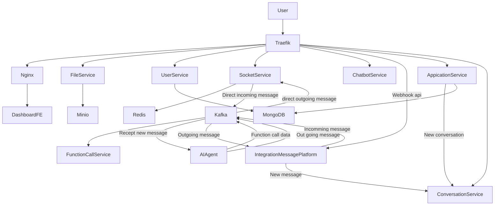
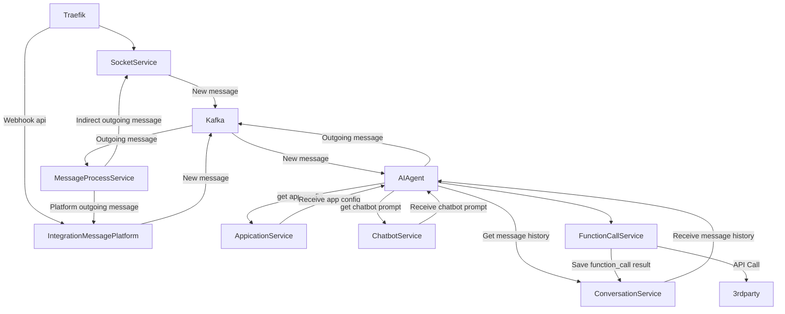

# System Architecture Overview

## High Level Overview

### Base flow

### Message flow

### Key Components
- **Traefik Gateway**: Central entry point for all APIs and Frontend traffic.

- **MongoDB**: Stores user data and system metadata.

- **Redis**: Provides caching and pub/sub capabilities.

- **Kafka**: Event streaming for chatbot and realtime communication.

- **Minio**: Object storage for user files and attachments.

### Core Services

#### Service	Description:
File Service	Handles file uploads and storage management
Dashboard FE	Frontend application served via Nginx
User Service	Authentication, authorization, user data
Socket Service	Real-time WebSocket communication
Chatbot Service	Manages chatbot sessions and AI responses

#### Message Flow
The user interacts with the frontend (Dashboard FE) via browser.

Traefik routes API requests to the respective services.

Chatbot Service publishes events to Kafka after processing messages.

Socket Service listens to Kafka events and pushes realtime updates to the clients over WebSocket.

Deployment
The system is orchestrated using Docker Compose for local development.
For production deployment, Kubernetes or ECS is recommended.

